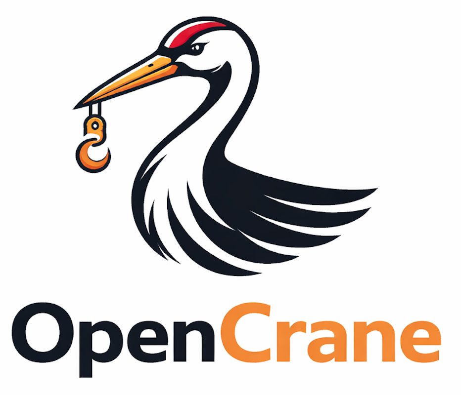

A standalone, extensible RAG/MCP pipeline for building AI-powered documentation search. Fetch docs from GitHub, generate `llms-full.txt` bundles, chunk and embed them, index into Milvus, and serve via an MCP server — all from one CLI.

## Table of Contents

- [Features](#features)
- [Credits](#credits)
- [Quick start](#quick-start)
- [Installation](#installation)
- [Usage](#usage)
  - [CLI](#cli)
    - [init](#opencrane-init----scaffold-a-new-project)
    - [add](#opencrane-add----add-documentation-sources)
    - [build](#opencrane-build----full-pipeline)
    - [fetch](#opencrane-fetch----fetch-docs-from-github)
    - [llms](#opencrane-llms----generate-llms-fulltxt-bundles)
    - [tokens](#opencrane-tokens----token-count-report)
    - [chunk](#opencrane-chunk----chunk-docs-into-rag-chunksjson)
    - [embed](#opencrane-embed----generate-embeddings)
    - [index](#opencrane-index----load-into-milvus)
    - [serve](#opencrane-serve----start-mcp-server)
    - [pack](#opencrane-pack----package-for-distribution)
    - [inspect](#opencrane-inspect----launch-mcp-inspector)
    - [visualize](#opencrane-visualize----see-where-a-paragraph-lands-in-the-embedding-space)
  - [Default file and directory names](#default-file-and-directory-names)
  - [Environment variables](#environment-variables)
  - [Source mapping file](#source-mapping-file-opencraneonfigyaml)
- [Extending OpenCrane](#extending-opencrane)
  - [Extension points](#extension-points)
  - [Section anchors](#section-anchors)
  - [Built-in fence types](#built-in-fence-types)
  - [Built-in YAML tree walkers](#built-in-yaml-tree-walkers)
  - [Writing a custom fence type](#writing-a-custom-fence-type)
  - [Writing a custom YAML tree walker](#writing-a-custom-yaml-tree-walker)
- [Development](#development)
- [License](#license)

## Features

- **Flexible RAG pipeline**: run the full flow (fetch → generate llms-full.txt → chunk → embed → index → serve) or use only the steps you need
- **MCP server**: exposes search tools consumable by Claude, Cursor, and any MCP-compatible client
- **Extensible**: subclass `OpenCraneConfig` to add custom fence types, chunking strategies, and YAML tree walkers; `openapi`, `asyncapi`, `crd`, and `json-schema` fence types are built in
- **Section anchors**: chunks record a `section_anchor` so citations link straight to the exact doc section (`{source_url}#{section_anchor}`); on by default, style-selectable, and overridable per project
- **CLI**: every pipeline step is a subcommand; works in CI/CD and non-Python projects


## Credits

OpenCrane was born from a real-world use case at [Cennso](https://cennso.com) — building AI-powered search over telco product documentation.

This project stands on the shoulders of some excellent open-source work:

- [Milvus](https://milvus.io) — vector database powering similarity search
- [Docling](https://github.com/DS4SD/docling) — document parsing and chunking
- [sentence-transformers](https://www.sbert.net) — embedding generation
- [rank-bm25](https://github.com/dorianbrown/rank_bm25) — BM25 keyword search that complements vector similarity search
- [Model Context Protocol](https://modelcontextprotocol.io) — MCP server standard that makes the search tools consumable by AI clients

## Quick start

Scaffold a new project without installing anything:

```bash
uvx opencrane init
```

This creates `.opencrane/`, `Dockerfile`, and `docker-compose.yml` in the current directory and walks you through adding documentation sources interactively. Then run `opencrane build` and `opencrane serve`.

## Installation

```bash
# with pip
pip install opencrane

# with uv
uv pip install opencrane

# with uvx (no install needed)
uvx opencrane <command>
```

## Usage

### CLI

All commands accept `--config myproject.config:MyConfig` to load a custom `OpenCraneConfig` subclass.

#### `opencrane init` — scaffold a new project

```bash
opencrane init [--podman] [--force] [--no-add]
```

Creates the `.opencrane/` directory and container files in the current directory:

| Generated file | Description |
|---|---|
| `.opencrane/config.yaml` | Source mapping and project configuration template with commented remote and local examples |
| `.opencrane/README.md` | Quick reference for the `.opencrane/` directory |
| `Dockerfile` | Multi-stage build: deps → model download → Milvus index → runtime |
| `docker-compose.yml` | Builds and runs the MCP server on port 8000 |

| Flag | Description |
|---|---|
| `--podman` | Generate `Containerfile` instead of `Dockerfile`; README uses `podman` commands |
| `--force` | Overwrite existing files (default: skip) |
| `--no-add` | Skip the interactive source addition prompt (useful for CI/scripts) |

> **Convention**: OpenCrane auto-discovers `.opencrane/extensions.py` as the project extensions config, so no `--config` flag or `OPENCRANE_CONFIG` env var is needed when using the `.opencrane/` layout.

After scaffolding, `init` prompts you to add documentation sources interactively (same flow as `opencrane add`). Use `--no-add` to skip the prompt.

#### `opencrane add` — add documentation sources

```bash
opencrane add
```

Interactively add documentation sources to your project. The command loops, asking for each source:

1. **GitHub repository** — adds an entry to `.opencrane/config.yaml` with the repo URL, docs path, and optional published docs URL. The `fetch` step will clone it on the next `opencrane build`.
2. **Existing llms.txt file** — provide a URL or local file path. OpenCrane downloads/copies it into `.opencrane/llmstxt/<name>/llms-full.txt`, and (when available) fetches the upstream companion `llms.txt` next to it for real per-page source URLs. The `llms` step merges it into the combined index and the `chunk` step assigns per-page `source_url`.

After each source, you're asked whether to add another or finish.

#### `opencrane build` — full pipeline

```bash
opencrane build [--config CLASS] [--sources-dir PATH]... [--llmstxt-dir PATH]
                [--chunks-file PATH] [--embeddings-file PATH]
```

Runs all steps in sequence: fetch → llms → chunk → embed → index.

| Flag | Description |
|---|---|
| `--sources-dir PATH` | Source directory to process; repeat for multiple dirs (overrides `AI_DOCS_SOURCES_DIRS` env var) |
| `--llmstxt-dir PATH` | Output directory for llms-full.txt files, and input directory for the chunk step (overrides `AI_DOCS_LLMSTXT_DIR` env var) |
| `--chunks-file PATH` | Output path for chunks JSON, and input for the embed step (overrides `AI_DOCS_CHUNKS_FILE` env var) |
| `--embeddings-file PATH` | Output path for embeddings JSON (overrides `AI_DOCS_EMBEDDINGS_FILE` env var) |

#### `opencrane fetch` — fetch docs from GitHub

```bash
opencrane fetch [--config CLASS] [--org NAME] [--repo PATH_KEY]
```

| Flag | Description |
|---|---|
| `--org NAME` | GitHub organisation to fetch from (overrides `ORG_NAME` env var) |
| `--repo PATH_KEY` | Fetch only this one repo by its path key in `.opencrane/config.yaml`, e.g. `external-sources/my-repo` (overrides `FETCH_REPO` env var) |

#### `opencrane llms` — generate llms-full.txt bundles

```bash
opencrane llms [--config CLASS] [--sources-dir PATH]... [--llmstxt-dir PATH] [--force]
```

Emits a clean `llms-full.txt` (no URLs injected into headings) plus a companion `llms.txt` index (page title → page URL) next to it. The `chunk` step reads both to assign each chunk its specific page `source_url`. See [docs/llms-generation.md](docs/llms-generation.md).

| Flag | Description |
|---|---|
| `--sources-dir PATH` | Source directory to process; repeat for multiple dirs (overrides `AI_DOCS_SOURCES_DIRS` env var) |
| `--llmstxt-dir PATH` | Output directory for llms-full.txt files (overrides `AI_DOCS_LLMSTXT_DIR` env var) |
| `--force` | Regenerate even if no git changes are detected in source directories |

#### `opencrane tokens` — token count report

```bash
opencrane tokens [--source-dir PATH] [--output-file PATH]
```

| Flag | Description |
|---|---|
| `--source-dir PATH` | Directory containing llmstxt output to count (overrides `TOKEN_SOURCE_DIR` env var) |
| `--output-file PATH` | Output path for the markdown report (overrides `TOKEN_OUTPUT_FILE` env var) |

#### `opencrane chunk` — chunk docs into .opencrane/chunks.json

```bash
opencrane chunk [--config CLASS] [--llmstxt-dir PATH] [--chunks-file PATH]
```

> Authoring docs that will be chunked? See [docs/authoring-guide.md](docs/authoring-guide.md) for how to structure markdown so chunks are high quality and retrievable.

Reads the companion `llms.txt` index (when present) alongside `llms-full.txt` to assign each chunk its specific page `source_url`; falls back to legacy inline-marker extraction for older bundles without an index.

| Flag | Description |
|---|---|
| `--llmstxt-dir PATH` | Directory containing llms-full.txt and its companion llms.txt (overrides `AI_DOCS_LLMSTXT_DIR` env var) |
| `--chunks-file PATH` | Output path for chunks JSON (overrides `AI_DOCS_CHUNKS_FILE` env var) |

#### `opencrane embed` — generate embeddings

```bash
opencrane embed [--config CLASS] [--chunks-file PATH] [--embeddings-file PATH]
```

| Flag | Description |
|---|---|
| `--chunks-file PATH` | Input chunks JSON file (overrides `AI_DOCS_CHUNKS_FILE` env var) |
| `--embeddings-file PATH` | Output embeddings JSON file (overrides `AI_DOCS_EMBEDDINGS_FILE` env var) |

#### `opencrane index` — load into Milvus

```bash
opencrane index [--config CLASS]
```

#### `opencrane serve` — start MCP server

```bash
opencrane serve [--config CLASS] [--transport stdio|http]
```

| Flag | Description |
|---|---|
| `--transport stdio` | *(default)* stdio transport for local MCP clients. Prints integration instructions for Claude Code, Cursor, Windsurf, VS Code, Zed, and Docker/Podman on startup |
| `--transport http` | HTTP transport on port 8000 (Streamable HTTP, stateless). Used inside Docker/Podman containers. Port configurable via `MCP_HTTP_PORT` env var |

##### Health endpoint (`/health`)

The HTTP transport exposes `GET /health` for container liveness/readiness probes (e.g. Cloud Run). It is an **honest, query-aware** check: rather than only confirming that services are wired up, it runs a real one-result search behind a timeout, reports memory headroom from the cgroup, and reports whether the heavy in-memory chunk maps are already resident. The overall `status` is the worst of the individual checks:

| `status` | HTTP code | Meaning |
|---|---|---|
| `healthy` | `200` | Serving queries normally |
| `degraded` | `200` | Still serving, but a warning sign is present (slow probe, low memory headroom, or missing collection stats) |
| `unhealthy` | `503` | Cannot serve a query (a service is down or the probe failed/timed out) |
| `initializing` | `503` | Services are still loading at startup |

Example response (`200`):

```json
{
  "status": "healthy",
  "checks": {
    "embeddings_service": "healthy",
    "milvus_service": "healthy",
    "collection_stats": { "row_count": 1234 },
    "heavy_maps": {
      "chunk_index_resident": true,
      "chunk_source_map_resident": true
    },
    "memory": {
      "source": "cgroup_v2",
      "used_bytes": 536870912,
      "limit_bytes": 2147483648,
      "headroom_pct": 75.0,
      "status": "healthy"
    },
    "query_probe": {
      "status": "healthy",
      "latency_ms": 143.7
    }
  }
}
```

`memory.status` is `unavailable` (and omits the byte fields) when no cgroup limit can be read, e.g. running outside a container. The same report is returned by the `health` MCP tool. The probe and memory thresholds are tunable — see the [health-check environment variables](#health-check-serve-http-transport).

> **Deploying the probe:** point the platform's liveness/readiness probe at `GET /health` on port 8000. Give the startup/initial-delay enough time for the embedding model to load (until then `/health` returns `503 initializing`), and use a longer liveness period so a real search isn't run every few seconds. **Do not bind-mount the Milvus Lite database** — Milvus Lite cannot open its `.db` from a bind-mounted volume (`Open local milvus failed`); bake it into the image with `COPY` instead (the generated `Dockerfile` already does this by building the DB in a dedicated stage).

#### `opencrane pack` — package for distribution

```bash
opencrane pack [--name NAME] [--output PATH] [--version VERSION]
```

Packages the built MCP server and data into a standalone Python package that others can run via `uvx`. After packing, share a one-liner:

```bash
# From PyPI (after publishing)
claude mcp add my-docs -- uvx my-docs-mcp

# From GitHub
claude mcp add my-docs -- uvx --from "git+https://github.com/you/my-docs-mcp" my-docs-mcp

# From local path
claude mcp add my-docs -- uvx --from .opencrane/pack/my-docs-mcp my-docs-mcp
```

The generated package includes the Milvus database and chunk index — recipients don't need to rebuild anything. The embedding model is downloaded automatically on first use.

Run `opencrane build` before packing. Use `--version` to bump the version when re-packing updated docs (so `uvx` pulls the new version instead of serving its cache).

Install the optional `build` dependency for wheel generation: `pip install opencrane[pack]`.

#### `opencrane inspect` — launch MCP Inspector

```bash
opencrane inspect [--config CLASS]
```

Launches the [MCP Inspector](https://github.com/modelcontextprotocol/inspector) web UI connected to the server via stdio — no Docker required. Requires `npx` (Node.js).

Web UI available at `http://localhost:5173`.

#### `opencrane visualize` — see where a paragraph lands in the embedding space

```bash
opencrane visualize --text "your paragraph here"
opencrane visualize --file paragraph.txt
echo "your paragraph" | opencrane visualize
```

Encodes the input paragraph with the same model as the indexed corpus, then renders an interactive HTML with three views side-by-side:

- **Scatter** — global PCA / UMAP / t-SNE projection of a corpus sample, with the new paragraph as a highlighted diamond and its top-K neighbors ringed.
- **Local neighborhood** — local PCA on just the paragraph + top-K neighbors. Every point has real coordinates, so distances between *neighbors* also carry meaning.
- **Per-source alignment** — horizontal bar chart of mean similarity per source repo, answering "which docs does this paragraph best fit?"

Key flags:

| Flag | Default | What it does |
|---|---|---|
| `--method pca\|umap\|tsne` | `umap` | Dimensionality-reduction algorithm |
| `--dim 2\|3` | `3` | Scatter dimensionality |
| `--viz scatter\|neighbors\|sources\|all` | `all` | Which views to render |
| `--color-by density\|source` | `density` | Scatter color mapping |
| `--sample N` | `0` (full corpus) | Cap the scatter at N randomly-sampled chunks (top-K neighbors always included). Use a smaller N if the browser slows down or UMAP / t-SNE is too slow. Neighbor finding always runs on the full corpus regardless. |
| `--neighbors K` | `12` | Number of nearest neighbors to highlight |
| `--output PATH` | `.opencrane/visualization.html` | Output HTML path |
| `--no-open` | — | Don't auto-open the HTML in a browser |

Requires the optional `viz` extra: `pip install 'opencrane[viz]'` (adds plotly, scikit-learn, umap-learn).

Useful for:
- **Duplicate detection** — if the top neighbor has very high similarity, you might be writing something that already exists.
- **Which-repo-does-this-belong-to** — the per-source bar chart tells you which docs site has the closest existing content.
- **Sanity-checking new docs** — if neighbors are a random mix of unrelated repos at low similarity, your paragraph is out-of-distribution.

### Debugging

Enable verbose logging for any command:

```bash
LOG_LEVEL=DEBUG opencrane build
LOG_LEVEL=DEBUG opencrane add
```

### Default file and directory names

OpenCrane uses these defaults for all pipeline output. Override them with CLI flags (one-off) or environment variables (persistent):

| File / directory | Default | CLI flag | Env var |
|---|---|---|---|
| llms-full.txt output dir | `.opencrane/llmstxt` | `--llmstxt-dir` | `AI_DOCS_LLMSTXT_DIR` |
| Chunks file | `.opencrane/chunks.json` | `--chunks-file` | `AI_DOCS_CHUNKS_FILE` |
| Embeddings file | `.opencrane/embeddings.json` | `--embeddings-file` | `AI_DOCS_EMBEDDINGS_FILE` |
| Token report output | `.opencrane/llmstxt/README.md` | `--output-file` | `TOKEN_OUTPUT_FILE` |
| Source mapping file | `.opencrane/config.yaml` | — | `MAPPING_FILE` |
| Milvus database file (Lite mode) | _(server mode)_ | — | `MILVUS_DB_PATH` |

### Environment variables

CLI flags take precedence over environment variables. Use env vars for persistent defaults (e.g. in CI/CD), and flags for one-off overrides.

**`fetch` and `llms` steps** — shared configuration for source tracking:

| Variable | Default | Description |
|---|---|---|
| `MAPPING_FILE` | `.opencrane/config.yaml` | Path to the source mapping file used by `fetch` (to record cloned repos) and `llms` (to build per-page source URLs in the companion `llms.txt` index) |

**`fetch` step** — only needed if you use `opencrane fetch` to pull docs from GitHub:

| Variable | Default | Description |
|---|---|---|
| `ORG_NAME` | `` | GitHub organisation to fetch repositories from (see also `--org` flag) |
| `FETCH_REPO` | `` | Restrict fetch to a single repo by path key (see also `--repo` flag) |
| `GITHUB_TOKEN` | `` | GitHub API token for authenticated requests |
| `DOCS_TOPIC` | `documentation` | GitHub topic used to discover repositories automatically within the org |
| `AUTO_DISCOVERY_ORGS` | `` | Whitelist of orgs where topic-based auto-discovery is enabled |
| `TARGET_DIR` | `external-sources` | Local directory where fetched docs are stored |

**`llms` step** — only needed if you use `opencrane llms` to generate llms-full.txt bundles:

| Variable | Default | Description |
|---|---|---|
| `AI_DOCS_SOURCES_DIRS` | `TARGET_DIR` | **Required when not using `opencrane fetch`.** Comma-separated list of source directories to process (see also `--sources-dir` flag) |
| `AI_DOCS_LLMSTXT_DIR` | `.opencrane/llmstxt` | Output directory for generated llms-full.txt files (see also `--llmstxt-dir` flag) |

**`tokens` step** — only needed if you use `opencrane tokens`:

| Variable | Default | Description |
|---|---|---|
| `TOKEN_SOURCE_DIR` | `.opencrane/llmstxt` | Directory containing llmstxt output to count (see also `--source-dir` flag) |
| `TOKEN_OUTPUT_FILE` | `.opencrane/llmstxt/README.md` | Output path for the markdown report (see also `--output-file` flag) |

**`chunk` step** — only needed if you use `opencrane chunk`:

| Variable | Default | Description |
|---|---|---|
| `AI_DOCS_LLMSTXT_DIR` | `.opencrane/llmstxt` | Directory containing llms-full.txt (see also `--llmstxt-dir` flag) |
| `AI_DOCS_CHUNKS_FILE` | `.opencrane/chunks.json` | Output path for the generated chunks (see also `--chunks-file` flag) |

**`embed` step** — only needed if you use `opencrane embed`:

| Variable | Default | Description |
|---|---|---|
| `AI_DOCS_CHUNKS_FILE` | `.opencrane/chunks.json` | Input chunks JSON file (see also `--chunks-file` flag) |
| `AI_DOCS_EMBEDDINGS_FILE` | `.opencrane/embeddings.json` | Output path for the generated embeddings (see also `--embeddings-file` flag) |
| `EMBEDDING_MODEL` | `nomic-ai/nomic-embed-text-v1.5` | HuggingFace embedding model to use |

**`index` and `serve` steps** — needed when loading into Milvus or running the MCP server:

OpenCrane supports two Milvus modes. Set `MILVUS_DB_PATH` to use **Milvus Lite** (a local file, no server needed — good for local dev). Leave it unset to connect to a **Milvus server** via `MILVUS_HOST` and `MILVUS_PORT`.

| Variable | Default | Description |
|---|---|---|
| `MILVUS_DB_PATH` | `` | Path to a local Milvus Lite database file (e.g. `./milvus.db`). When set, `MILVUS_HOST` and `MILVUS_PORT` are ignored |
| `MILVUS_HOST` | `localhost` | Milvus server host (server mode only) |
| `MILVUS_PORT` | `19530` | Milvus server port (server mode only) |
| `MILVUS_COLLECTION` | `ai_docs_chunks_v1` | Milvus collection name |
| `HYBRID_ALPHA` | `0.6` | Weight of vector search vs keyword search (1.0 = pure vector, 0.0 = pure BM25) |

#### Health check (`serve`, HTTP transport)

Tune the [`/health`](#health-endpoint-health) probe and thresholds. All optional.

| Variable | Default | Description |
|---|---|---|
| `OPENCRANE_HEALTH_PROBE_QUERY` | `documentation` | Query used for the functional search probe |
| `OPENCRANE_HEALTH_PROBE_TIMEOUT` | `10` | Hard timeout (seconds) for the probe; exceeding it reports `unhealthy` |
| `OPENCRANE_HEALTH_PROBE_BUDGET` | `2` | Soft latency budget (seconds); a slower-but-successful probe reports `degraded` |
| `OPENCRANE_HEALTH_MEM_WARN_HEADROOM` | `0.15` | Minimum free-memory fraction; below it, memory is reported `degraded` |

### Source mapping file (`.opencrane/config.yaml`)

OpenCrane maintains a file called `.opencrane/config.yaml` that records where each documentation source lives and where its content can be found online. It is used by the `fetch` step (to track cloned repos) and by the `llms` step (to build the companion `llms.txt` index of per-page source URLs). The `fetch` step populates it automatically; for manually managed sources you can edit it directly.

Each entry supports the following fields:

| Field | Required | Description |
|---|---|---|
| `url` | Yes (for `fetch`) | GitHub repository URL — used by `opencrane fetch` to clone the repo and to build per-page GitHub source URLs in the companion `llms.txt` index |
| `docs_path` | No | Path within the repo where docs are stored (e.g. `docs`) |
| `docs_url` | No | Base URL of the published documentation site (e.g. `https://docs.example.com/product`). When set, per-page URLs are built from it instead of `url` — lets AI agents point users to rendered docs rather than raw GitHub files. For external `llmstxt` sources with no companion `llms.txt`, `docs_url` is used as the base URL for every page in that bundle. If neither is set, chunks from that source get no `source_url`. |
| `manual` | No | When `true`, the entry is user-managed and will not be overwritten by `opencrane fetch` auto-discovery |
| `branch` | No | Pin to a specific branch (e.g. `develop`) |
| `tag` | No | Pin to a specific git tag (e.g. `v2.1.0`) |
| `release` | No | Pin to a specific GitHub release by its tag name (e.g. `v2.1.0`) — validated via the Releases API |
| `sha` | No | Pin to a specific commit SHA |

**Ref pinning**: By default, `opencrane fetch` pulls from the latest GitHub release, falling back to the default branch if no releases exist. Use `branch`, `tag`, `release`, or `sha` to pin a source to a specific ref instead. Only one should be set; if multiple are present, priority is `sha` > `tag` > `release` > `branch` (a warning is logged).

Example:

```yaml
sources:
  external-sources/my-product:
    url: https://github.com/myorg/my-product
    docs_path: docs
    docs_url: https://docs.myorg.com/my-product
    manual: true
    tag: v2.1.0
```

## Extending OpenCrane

Subclass `OpenCraneConfig` to register project-specific extensions:

```python
# myproject/config.py
from opencrane import OpenCraneConfig
from opencrane.fences import CodeFenceConfig, inline_file
from opencrane.rag.services.yaml_chunker import YamlChunkingStrategy
from opencrane.rag.services.code_chunker import CodeChunkingStrategy
from opencrane.rag.services.prose_chunker import ProseChunkingStrategy
from myproject.strategies.custom import CustomChunkingStrategy
from myproject.walkers.terraform import TerraformTreeWalker

class MyConfig(OpenCraneConfig):
    fence_types = {
        **OpenCraneConfig.fence_types,  # keep openapi, asyncapi, crd, json-schema
        "terraform": CodeFenceConfig(fence_type="terraform", handler=inline_file),
    }
    chunking_strategies = [
        YamlChunkingStrategy(),
        CustomChunkingStrategy(),
        CodeChunkingStrategy(),
        ProseChunkingStrategy(),
    ]
    yaml_tree_walkers = [
        *OpenCraneConfig.yaml_tree_walkers,  # keep CRD, OpenAPI, JSON Schema
        TerraformTreeWalker,
    ]
```

Then use it:

```bash
opencrane build --config myproject.config:MyConfig
```

### Extension points

| Extension point | Pipeline step | What it does |
|---|---|---|
| `fence_types` | `llms` | Register custom fence language identifiers and control how matching blocks are transformed during llms-full.txt generation |
| `chunking_strategies` | `chunk` | Add or replace chunking strategies for different content types |
| `yaml_tree_walkers` | `chunk` | Add walkers for custom YAML document formats |
| `section_anchor_for` | `chunk` | Build the in-page anchor slug recorded in each chunk's `section_anchor` metadata |

### Section anchors

Each markdown sub-section chunk records a **`section_anchor`** in its metadata — the in-page anchor slug of its nearest section heading (level ≥ 2; the page-title H1 is skipped). `source_url` stays a clean page link, and consumers build a direct section link by joining the two:

```
{source_url}#{section_anchor}
```

For example a chunk under the "Who We Serve" heading of the About page gets `source_url: https://docs.example.com/guide/about` and `section_anchor: who-we-serve`, i.e. `https://docs.example.com/guide/about#who-we-serve`. The `search_docs` results expose it on a `Section Anchor:` line, and `get_metadata_schema` documents it.

**Choosing a style** — set `section_anchor_style` in `.opencrane/config.yaml` (no subclass needed):

```yaml
section_anchor_style: generic   # default — GitBook/GitHub-style slugs
# section_anchor_style: none    # disable section anchors entirely
```

**Writing a custom anchor builder** — when your docs host slugs headings differently, override `section_anchor_for` in your config subclass (`.opencrane/extensions.py:Config`). It receives the nearest heading and returns the fragment slug (no `#`), or `None` to skip:

```python
from opencrane import OpenCraneConfig


class Config(OpenCraneConfig):
    def section_anchor_for(self, heading):
        if not heading:
            return None
        # Example: a host that lowercases and uses underscores instead of hyphens
        return heading.strip().lower().replace(" ", "_")
```

An override takes precedence over `section_anchor_style`.

### Built-in fence types

`openapi`, `asyncapi`, `crd`, and `json-schema` are registered by default in `OpenCraneConfig`. Each uses the `opencrane.fences.inline_file` handler, which reads the file path written inside the fence block, inlines the file content, and adds a `### URL` section marker so the chunker assigns a per-file source URL to the resulting chunks.

Usage in markdown:

````markdown
```openapi
path/to/openapi.json
```

```asyncapi
path/to/asyncapi.yaml
```
````

No `extensions.py` is needed for these types. To extend with additional fence types that use the same inlining behaviour, pass `**OpenCraneConfig.fence_types` when defining `fence_types` in your config subclass (as shown in the example above).

### Built-in YAML tree walkers

- `K8sCRDTreeWalker` — Kubernetes CustomResourceDefinitions
- `OpenAPITreeWalker` — OpenAPI 3.x specs
- `JsonSchemaTreeWalker` — JSON Schema documents

### Writing a custom fence type

Register a fence language identifier and provide a `handler` function. When a ` ```my-type ... ``` ` block is encountered during `llms` generation, OpenCrane calls your handler with the raw block content plus the file context, and replaces the block with the returned string.

```python
from pathlib import Path
from opencrane.fences import CodeFenceConfig

def my_handler(content: str, file_path: Path, project_dir: Path, project_name: str) -> str:
    # content      — raw text inside the fence block
    # file_path    — path of the markdown file containing the block
    # project_dir  — root directory of the project being processed
    # project_name — name of the project (used for source URL building)
    # return the full replacement string
    return f"```yaml\n# processed\n{content}\n```\n"

fence_types = {
    "my-type": CodeFenceConfig(fence_type="my-type", handler=my_handler),
}
```

To inline a file referenced by path inside the block, use the built-in `inline_file` handler from `opencrane.fences`:

```python
from opencrane.fences import CodeFenceConfig, inline_file

fence_types = {
    "my-type": CodeFenceConfig(fence_type="my-type", handler=inline_file),
}
```

`inline_file` reads the file path from the fence block content, inlines the file, and adds a `### URL` source annotation so the chunker assigns per-file source URLs to the resulting chunks.

### Writing a custom YAML tree walker

```python
from opencrane.walkers.base import YamlTreeWalker

class TerraformTreeWalker(YamlTreeWalker):
    @classmethod
    def can_handle(cls, doc: dict) -> bool:
        return "terraform" in doc

    def walk(self):
        # return List[Chunk]
        ...
```

## Authentication & Authorization

The HTTP transport (`opencrane serve --transport http`) supports OAuth 2.1 authentication and scope-based content authorization. The stdio transport is always open (per the MCP spec).

- **`local` mode** — OpenCrane acts as its own authorization server. An MCP client is redirected to a browser login form where the consumer pastes a token or enters a username/password. No external identity provider needed. Configure via `auth.type: local` and set `PUBLIC_URL` + `OPENCRANE_ACCESS_TOKEN` (or `OPENCRANE_LOGIN_USER`/`OPENCRANE_LOGIN_PASS`).
- **`oauth` mode** — OpenCrane is an OAuth resource server; token issuance is handled by an external IdP (Keycloak, Auth0, Entra, …). Requires `pip install 'opencrane[auth]'`. Configure via `auth.type: oauth` with `oidc.issuer` and `oidc.audience`.
- **Scope-based source gating** — `scope_sources` maps OAuth scopes to sets of documentation sources. Callers only retrieve content from sources their token's scopes permit.
- **`middleware` hook** — for authorization that config cannot express, register a custom ASGI middleware on your `OpenCraneConfig` subclass and call `set_allowed_sources(...)` to declare a request's permitted sources (e.g. resolve them from an external permissions service). Keeps project-specific auth logic out of OpenCrane.
- **`custom` mode** — supply your own `token_verifier` or `auth_provider` on `OpenCraneConfig` for full control over token validation or the authorization server.

See [docs/auth.md](docs/auth.md) for the full configuration reference, environment variables, and worked examples (including a complete external-permissions middleware).

## Development

```bash
git clone https://github.com/derberg/OpenCrane.git
cd OpenCrane

# with pip
pip install -e ".[dev]"

# with uv
uv sync --extra dev

pytest
```

## License

Apache-2.0